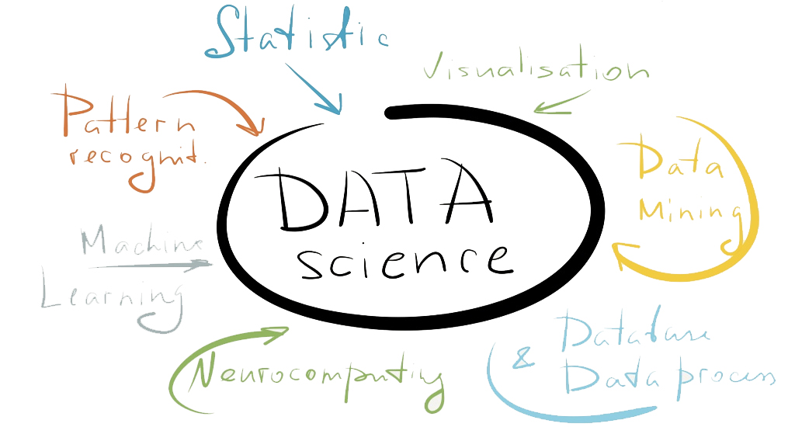

# Data-Science-Free  
Free Resources For Data Science 

## Show your support :octocat: by giving it a :star: 

## PYTHON

* **Introduction to Python, The Scientific Libraries, Advanced Python Programming and the Pandas Section**.[click here](https://lectures.quantecon.org/py/) 

* **Chapters 1 - 4** of this [book](https://github.com/jakevdp/PythonDataScienceHandbook/blob/8a34a4f653bdbdc01415a94dc20d4e9b97438965/notebooks/Index.ipynb)                  

* **Then this Pandas** [tutorial](https://pandas.pydata.org/pandas-docs/stable/getting_started/10min.html)

* **Python for Data Analysis, [2nd Edition](https://github.com/wesm/pydata-book)** 

* **More [Python](https://scipython.com/book/) by Scipy**

* **(My Favourite)Udemy Complete Python Bootcamp by Jose Portilla** [Google Drive](https://drive.google.com/drive/folders/0ByWO0aO1eI_MaExzRWZ2S0dndjQ?usp=sharing)

* **Udacity - Developing scalable app in Python.** [Google Drive](https://drive.google.com/open?id=0ByWO0aO1eI_MT1E1NW91VlJ2TVk)

* **Python Ebooks on [Google Drive](https://drive.google.com/open?id=0ByWO0aO1eI_MZ19fbVV3YS1hckk)**

## Practice Python Projects

* [Project based](https://github.com/tuvtran/project-based-learning#python)

* [Project Euler](https://projecteuler.net/)

## CALCULUS

* **Essence of Calculus** [3Blue1Brown](https://www.youtube.com/watch?v=WUvTyaaNkzM&list=PLZHQObOWTQDMsr9K-rj53DwVRMYO3t5Yr)

* **Khan Academy calculus-1 [here](https://www.khanacademy.org/math/calculus-1)**

* **Khan Academy calculus-2 [here](https://www.khanacademy.org/math/calculus-2)**

* **Khan Academy multivariable calculus [here](https://www.khanacademy.org/math/multivariable-calculus)**

## LINEAR ALGEBRA

* **Manga Guide to Linear Algebre** [Google Drive](https://drive.google.com/file/d/1sdnIBqPjSgPzitrInV0roHTEJ856ntYe/view?usp=sharing)  

* **[3Blue1Brown](https://www.youtube.com/watch?v=fNk_zzaMoSs&list=PLZHQObOWTQDPD3MizzM2xVFitgF8hE_ab)**

* **Khan Academy [linear algebra](https://www.khanacademy.org/math/linear-algebra)**

* **UBC Maths by James B. Carrell** [here](https://www.math.ubc.ca/~carrell/NB.pdf)

## PROBABILITY AND STATISTICS

* **Khan Academy** [course](https://www.khanacademy.org/math/statistics-probability)

* **Think Stats** [pdf](http://greenteapress.com/thinkstats/thinkstats.pdf)

* **Probability** [Cheat sheet](http://www.wzchen.com/probability-cheatsheet/)

* **Bayesian-Methods-for-Hackers** [here](http://camdavidsonpilon.github.io/Probabilistic-Programming-and-Bayesian-Methods-for-Hackers/)

## STATISTICAL LEARNING 

* **An Introduction to Statistical Learning** [Essential](https://www-bcf.usc.edu/~gareth/ISL/index.html)

* **Elements of Statistical Learning Stanford** [Extremely useful](https://web.stanford.edu/~hastie/ElemStatLearn/)

## DATA STRUCTURES AND ALGORITHMS IN PYTHON

* **Udacity** [Course free](https://eu.udacity.com/course/data-structures-and-algorithms-in-python--ud513)

* **Another good resource** [here](http://interactivepython.org/runestone/static/pythonds/index.html)

## Harvard CS109

* **[CS109](https://cs109.github.io/2015/index.html)**

## MACHINE LEARNING

* **Hands on Machine Learning with Tensorflow & Scikit-learn** [Google Drive](https://drive.google.com/file/d/1CHv8CTQRRaoSDeBGN0_tkvd0D2E9mYxo/view?usp=sharing)

* **Stanford - AndrewNg Course** [YouTube](https://www.youtube.com/watch?v=PPLop4L2eGk&list=PLLssT5z_DsK-h9vYZkQkYNWcItqhlRJLN)

* **Udemy - Machine Learning A-Z using Python & R by SuperDataScience Team** [here](https://drive.google.com/open?id=1mTUyna5oynW4RVItOldP2f2yhe_3xL4s)

* **Ebooks for ML on** [Google Drive](https://drive.google.com/drive/folders/0ByWO0aO1eI_Md1JGZW9NSDFpQ1U?usp=sharing)

* **More Ebooks on** [Google Drive](https://drive.google.com/open?id=1gmW2K_VAQrXPWAfgQcg-3umt5ipV7-G9)

* **Manning publication books on** [Google Drive](https://drive.google.com/open?id=1yXZ1HgyQ7yPUJI8cC7ZnTWi0BAbxq_Kg)

* **Cheat Sheets for ML, DeepL, AI** [Google Drive](https://drive.google.com/open?id=1qYgzm4oTVYIR_iEsT4ZW9l9o3GUMSzYG)

* **Google** Machine Learning crash course using Tensorflow [here](https://developers.google.com/machine-learning/crash-course/)

## INTERVIEW QUESTIONS

* **100 Data Science Interview Questions and [Answers](https://www.dezyre.com/article/100-data-science-interview-questions-and-answers-general-for-2018/184)**

* **40 Interview Questions asked at [Startups](https://www.analyticsvidhya.com/blog/2016/09/40-interview-questions-asked-at-startups-in-machine-learning-data-science/) in Machine Learning**

* **Top 100 Data science interview [questions](http://nitin-panwar.github.io/Top-100-Data-science-interview-questions/?utm_campaign=News&utm_medium=Community&utm_source=DataCamp.com)**

* **109 Data Science Interview Questions and Answers for 2019** [Springboard](https://www.springboard.com/blog/data-science-interview-questions/)

## [PAPERS WITH CODE ](https://paperswithcode.com/)

## Blogs to Follow

* **[KDNuggets](https://www.kdnuggets.com/)**

* **[Data Science Plus](https://datascienceplus.com/)**

* **[Analytics Vidhya](https://www.analyticsvidhya.com/)**

* **[Towards Data Science](https://towardsdatascience.com/)**

# Support

***Created by Shubham Kumar***

**[GitHub](https://github.com/imskr)**

**[Linkedin](https://www.linkedin.com/in/imskr)**
