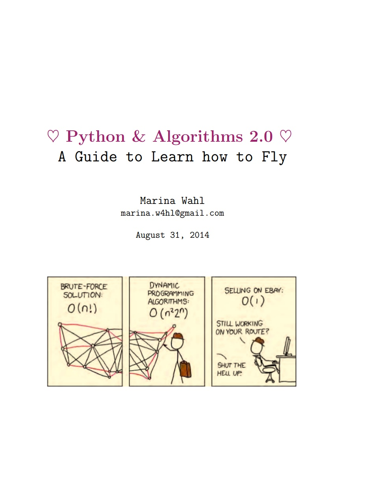
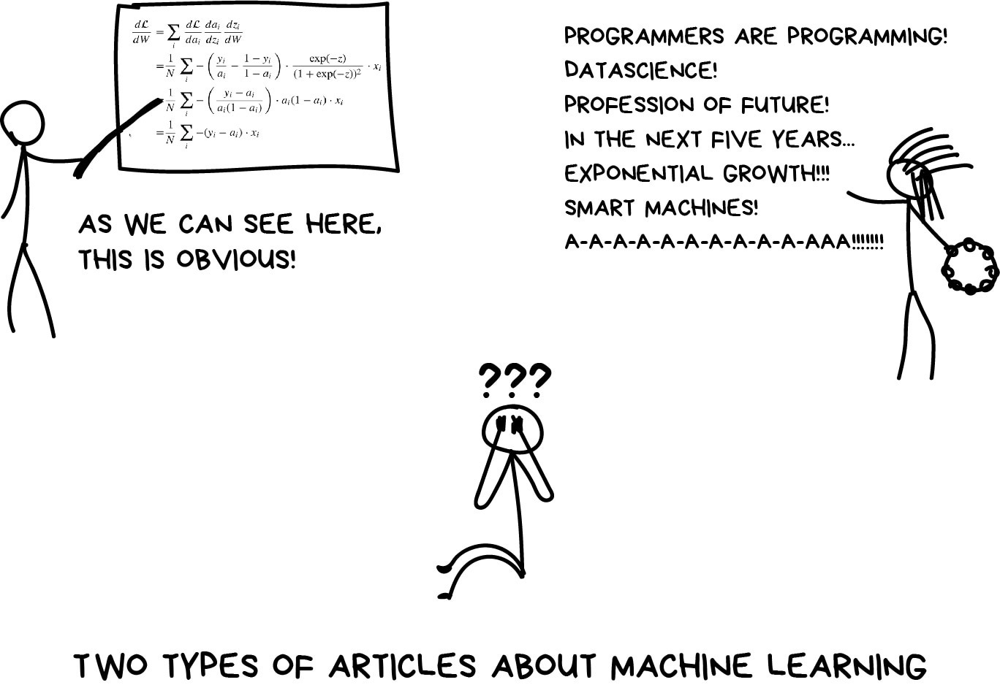

    

<h4 align="center">A collection of awesome manuals, blogs, cheats, resources and more.</h4>

 

  
    
  
  
  

 

  

  Created by <a href="https://github.com/imskr"><strong>Shubham Kumar</strong></a>

# Show your support by giving :octocat: a :star:
**DISCLAIMER:** ***This is for absolute beginners, no experience needed.*** 

## Table of Contents

* [Python](#python)
   * [Pandas](#pandas)
   * [Algorithms in Python](#algorithms-in-python)
   * [Practice Python](#practice-python)
* [Calculus](#calculus)
* [Linear Algebra](#linear-algebra)
* [Algorithms in Python](#algorithms-in-python)
* [Probability & Stats](#probability-and-statistics)
* [Statistical Learning](#statistical-learning)
* [Machine Learning](#machine-learning)
  * [Practice ML](#practice-ml)
* [Deep Learning](#deep-learning)
  * [AI Projects](#ai-projects)
* [Medium Blog Posts](#AWESOME-BLOG-POSTS-ON-MEDIUM)
* [Playgrounds](#playgrounds)
* [Research Papers](#research-papers)
* [Interview Questions](#interview-questions)
* [Top Rated Courses](#top-rated-courses)
* [Blogs to Follow](#blogs-to-follow)

## PYTHON

    

* **Python 3 tutorial by Programiz** [Here](https://www.programiz.com/python-programming/tutorial)

* **Introduction to Python 3** [Sentdex](https://www.youtube.com/watch?v=eXBD2bB9-RA&list=PLQVvvaa0QuDeAams7fkdcwOGBpGdHpXln)

* **Quantative Economics with Python** [Here](https://lectures.quantecon.org/py/) 

* **Python Data science handbook** [Chapter 1-4](https://github.com/jakevdp/PythonDataScienceHandbook/blob/8a34a4f653bdbdc01415a94dc20d4e9b97438965/notebooks/Index.ipynb)               

* **Python for Data Analysis** [2nd Edition](https://github.com/wesm/pydata-book) 

* **Learning Python 5th edition, oreilly publication by** [Mark Lutz](https://drive.google.com/file/d/14ayuNFEo9VZ-xstgXlyMgDFHoAgrGqJU/view?usp=sharing) **(LONG VERSION)**

* **Python by** [Scipy](https://scipython.com/book/) 

* **Python Ebooks on** [Google Drive](https://drive.google.com/open?id=0ByWO0aO1eI_MZ19fbVV3YS1hckk)

## PANDAS

* **Pandas & Data Analysis by [mlcourse.ai](https://www.youtube.com/watch?v=fwWCw_cE5aI&feature=youtu.be)** (Video)

* **Pandas by** [Pydata](https://pandas.pydata.org/pandas-docs/stable/getting_started/10min.html)

* **Effective Pandas** [GitHub](https://github.com/TomAugspurger/effective-pandas)

* **Pandas** [Cheatsheets](https://github.com/pandas-dev/pandas/blob/master/doc/cheatsheet/Pandas_Cheat_Sheet.pdf)

* **Pandas Data School** [Videos](https://www.youtube.com/watch?v=yzIMircGU5I&list=PL5-da3qGB5ICCsgW1MxlZ0Hq8LL5U3u9y)

## ALGORITHMS IN PYTHON

* **Python & Algorithms 2.0 by Marina Wahl** [Pdf](https://drive.google.com/file/d/1rR0GSEAqVtFDWRDdK1NLEJvc8oKC94PT/view?usp=sharing)

* **Udacity** [Course](https://eu.udacity.com/course/data-structures-and-algorithms-in-python--ud513)

* **Another good resource** [Here](http://interactivepython.org/runestone/static/pythonds/index.html)

* **Visualising algorithms through animation** [Visit](https://visualgo.net/en)

## PRACTICE PYTHON

* [Project based](https://github.com/tuvtran/project-based-learning#python)

* [Project Euler](https://projecteuler.net/)

## CALCULUS

* **Essence of Calculus** [3Blue1Brown PlayList](https://www.youtube.com/watch?v=WUvTyaaNkzM&list=PLZHQObOWTQDMsr9K-rj53DwVRMYO3t5Yr)

* **Khan Academy calculus-1** [Here](https://www.khanacademy.org/math/calculus-1)

* **Khan Academy calculus-2** [Here](https://www.khanacademy.org/math/calculus-2)

* **Khan Academy multivariable calculus** [Here](https://www.khanacademy.org/math/multivariable-calculus)

## LINEAR ALGEBRA

    

* **Manga Guide to Linear Algebre** [Google Drive](https://drive.google.com/file/d/1sdnIBqPjSgPzitrInV0roHTEJ856ntYe/view?usp=sharing)  

* **3Blue1Brown** [PlayList](https://www.youtube.com/watch?v=fNk_zzaMoSs&list=PLZHQObOWTQDPD3MizzM2xVFitgF8hE_ab)

* **Khan Academy** [Linear algebra](https://www.khanacademy.org/math/linear-algebra)

* **UBC Maths by James B. Carrell** [Here](https://www.math.ubc.ca/~carrell/NB.pdf)

* **MIT** [Linear algebra](https://www.youtube.com/playlist?list=PLE7DDD91010BC51F8)

## PROBABILITY AND STATISTICS

* **Khan Academy** [Course](https://www.khanacademy.org/math/statistics-probability)

* **Think Stats** [Pdf](http://greenteapress.com/thinkstats/thinkstats.pdf)

* **Probability** [Cheat sheet](http://www.wzchen.com/probability-cheatsheet/)

* **Bayesian-Methods-for-Hackers** [Here](http://camdavidsonpilon.github.io/Probabilistic-Programming-and-Bayesian-Methods-for-Hackers/)

## STATISTICAL LEARNING 

* **An Introduction to Statistical Learning** [Essential](https://www-bcf.usc.edu/~gareth/ISL/index.html)

* **Elements of Statistical Learning Stanford** [Extremely useful](https://web.stanford.edu/~hastie/ElemStatLearn/)

## MACHINE LEARNING

    

* **Machine Learning: An Algorithmic Perspective** [Here](https://doc.lagout.org/science/Artificial%20Intelligence/Machine%20learning/Machine%20Learning_%20An%20Algorithmic%20Perspective%20%282nd%20ed.%29%20%5BMarsland%202014-10-08%5D.pdf)

* **Practical Machine Learning Tutorial with Python** [Sentdex](https://www.youtube.com/watch?v=OGxgnH8y2NM&list=PLQVvvaa0QuDfKTOs3Keq_kaG2P55YRn5v)

* **Stanford - AndrewNg Course** [YouTube](https://www.youtube.com/watch?v=PPLop4L2eGk&list=PLLssT5z_DsK-h9vYZkQkYNWcItqhlRJLN)

* **Jason Mayes (Google Engineer ML Class 101)** [Slides](https://docs.google.com/presentation/d/1kSuQyW5DTnkVaZEjGYCkfOxvzCqGEFzWBy4e9Uedd9k/mobilepresent?slide=id.g168a3288f7_0_58)

* **Ebooks for ML on** [Google Drive](https://drive.google.com/drive/folders/0ByWO0aO1eI_Md1JGZW9NSDFpQ1U?usp=sharing)

* **More Ebooks on** [Google Drive](https://drive.google.com/open?id=1gmW2K_VAQrXPWAfgQcg-3umt5ipV7-G9)

* **Manning publication books on** [Google Drive](https://drive.google.com/open?id=1yXZ1HgyQ7yPUJI8cC7ZnTWi0BAbxq_Kg)

* **Cheat Sheets for ML, DeepL, AI** [Google Drive](https://drive.google.com/open?id=1qYgzm4oTVYIR_iEsT4ZW9l9o3GUMSzYG)

* **Google Machine Learning crash course using Tensorflow (Not for Beginners)** [Here](https://developers.google.com/machine-learning/crash-course/)

* **Reinforcement Learning Book by Andrew Barto and Richard S. Sutton** [Google Drive](https://drive.google.com/file/d/1OFquNBwdPxFFFbxCixBDHYUEmnbimegH/view?usp=sharing)

* **Stanford's CS 229 Machine Learning** [VIP Cheatsheet](https://github.com/afshinea/stanford-cs-229-machine-learning)

## PRACTICE ML

* **Home for Data Science -** [Kaggle](https://www.kaggle.com/)

## DEEP LEARNING

    

* **Grokking Deep Learning by Andrew Trask**

* **Practical Deep Learning for Coders** [Fast-ai](https://course.fast.ai/)

* **MIT Deep Learning** [Lex-Fridman](https://www.youtube.com/watch?v=O5xeyoRL95U&list=PLrAXtmErZgOeiKm4sgNOknGvNjby9efdf)

* **MIT 6.S191: Introduction to Deep Learning** [Alexander-Amini](https://www.youtube.com/playlist?list=PLtBw6njQRU-rwp5__7C0oIVt26ZgjG9NI)

* **Demystifying RL** [Intel AI](https://www.intel.ai/demystifying-deep-reinforcement-learning/#gs.0tu98m)

* **Deep RL Bootcamp** [Berkeley CA](https://sites.google.com/view/deep-rl-bootcamp/lectures)

## AI PROJECTS

* **Plant Disease Detector using Pytorch & fastai** [Visit](https://github.com/imskr/Plant_Disease_Detection) 

* **Implement a Pong-playing agent** [Pong from Pixels](http://karpathy.github.io/2016/05/31/rl/)

* **Flappy-Bird Playing agent in** [JavaScript](https://github.com/imskr/Flappy-Bird-AI)

## AWESOME BLOG POSTS ON MEDIUM

* **Simple Reinforcement Learning with Tensorflow series by** [Arthur Juliani](https://medium.com/emergent-future/simple-reinforcement-learning-with-tensorflow-part-0-q-learning-with-tables-and-neural-networks-d195264329d0)

* **Machine Learning for Humans by** [Vishal Maini](https://medium.com/machine-learning-for-humans/why-machine-learning-matters-6164faf1df12)

## PLAYGROUNDS

* **Tensorflow [Playground](https://playground.tensorflow.org/)**

* **Machine Learning [Playground](http://ml-playground.com/)**

## RESEARCH PAPERS 

* **[PAPERS WITH CODE](https://paperswithcode.com/)**

## INTERVIEW QUESTIONS

* **100 Data Science Interview Questions and** [Answers](https://www.dezyre.com/article/100-data-science-interview-questions-and-answers-general-for-2018/184)

* **40 Interview Questions asked at startups in Machine Learning** [Here](https://www.analyticsvidhya.com/blog/2016/09/40-interview-questions-asked-at-startups-in-machine-learning-data-science/) 

* **Top 100 Data science interview** [Questions](http://nitin-panwar.github.io/Top-100-Data-science-interview-questions/?utm_campaign=News&utm_medium=Community&utm_source=DataCamp.com)

* **109 Data Science Interview Questions and Answers for 2019 on** [Springboard](https://www.springboard.com/blog/data-science-interview-questions/)

* **111 Data Science Interview Questions with Detailed Answers** [Here](https://rpubs.com/JDAHAN/172473)

## TOP RATED COURSES

* **Open Machine Learning Course [mlcourse.ai](https://mlcourse.ai/)**

* **CS294-158 Deep Unsupervised Learning [Spring 2019](https://sites.google.com/view/berkeley-cs294-158-sp19/home)**

* **UC Berkeley CS294-112 [Deep Reinforcement Learning](http://rail.eecs.berkeley.edu/deeprlcourse/)**

* **UCL Course on [RL](http://www0.cs.ucl.ac.uk/staff/d.silver/web/Teaching.html)** 

* **CS109 Data Science Course - [Harvard](http://cs109.github.io/2015/pages/videos.html)**

* **Python for Data Science and Machine Learning Bootcamp - [Udemy](https://www.udemy.com/course/python-for-data-science-and-machine-learning-bootcamp/?LSNPUBID=OyHlmBp2G0c&ranEAID=OyHlmBp2G0c&ranMID=39197&ranSiteID=OyHlmBp2G0c-vQFHeLPpk94Hgv3dq6AX0A&utm_medium=udemyads&utm_source=aff-campaign) (Paid)**

* **Introduction to Data Science - [Metis](https://www.thisismetis.com/courses/introduction-to-data-science?utm_source=LDS&utm_medium=affiliate&utm_campaign=LDS2019affiliate) (Paid)**

## Blogs to Read

* **Machine Learning for Everyone** [Blog](https://vas3k.com/blog/machine_learning/)

* **[KDNuggets](https://www.kdnuggets.com/)**

* **[Data Science Plus](https://datascienceplus.com/)**

* **[Analytics Vidhya](https://www.analyticsvidhya.com/)**

* **[Towards Data Science](https://towardsdatascience.com/)**

 

## Contributors ✨

<table>
    <tr>
        <td align="center"><a href="https://github.com/AishwaryaDASH">
             
            <b>Aishwarya</b></a>
             
            <a href="https://github.com/frontbench-open-source/Data-Science-Free/commits?author=AishwaryaDASH" title="Commits">📖</a>
        </td>
        <td align="center"><a href="https://github.com/Sayan-Ghosh">
             
            <b>Sayan Ghosh</b></a>
             
            <a href="https://github.com/frontbench-open-source/Data-Science-Free/commits?author=Sayan-Ghosh" title="Commits">📖</a>
        </td>
        <td align="center"><a href="https://github.com/komalmann">
             
            <b>Komal Mann</b></a>
             
            <a href="https://github.com/frontbench-open-source/Data-Science-Free/commits?author=komalmann" title="Commits">📖</a>
        </td>
    </tr>
</table>

 

>You take the blue pill, the story ends. You wake up in your 
>bed and believe whatever you want to believe. You take the 
>red pill, you stay in Wonderland, and I show you how deep 
>the rabbit hole goes.” — Morpheus

 

    

